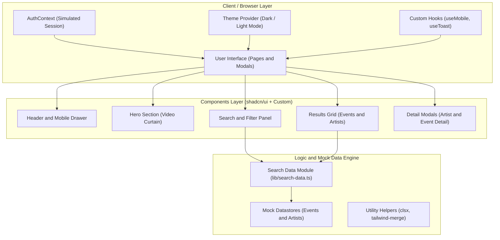

# NatyaSetu (नाट्यसेतु) — The Bridge to Indian Theatre

[](https://nextjs.org/)
[](https://react.dev/)
[](https://tailwindcss.com/)
[](https://www.typescriptlang.org/)
[](https://pnpm.io/)
[](LICENSE)

**NatyaSetu** (meaning *"Bridge to Drama"* in Sanskrit) is a premium, modern web platform designed to seamlessly connect theater enthusiasts with regional performances, independent artists, street troupes, and classic stage dramas across India. 

From regional masterpieces like Marathi classic *Natsamrat* to experimental Bengali street *Jaatra*, NatyaSetu serves as the digital cultural gateway celebrating the rich heritage of Indian performing arts.

---

## Key Features

### For Audiences & Theater Enthusiasts
*   **Immersive Cinematic Hero Section:** An interactive hero panel featuring a cinematic video background of theater curtains opening, drawing users into the theatrical atmosphere.
*   **Intelligent Unified Search:** Real-time search engine powered by city, language, genre, and text keywords to find the exact performance or troupe you are looking for.
*   **Dynamic Event & Artist Modals:** Detailed overlay modals to explore event info (timings, ticket prices, venues) and artist portfolios (bios, languages spoken, follower counts, cities) without losing browsing context.
*   **Responsive Fluid Layout:** Custom mobile-first responsive design featuring specialized adaptive mobile components (`use-mobile` hook navigation and touch-optimized sheets).
*   **Simulated Authentication Flow:** Dedicated credentials-based sign-in and sign-up modals to support personalized bookmarking and community features.

### For Troupes & Performing Artists
*   **Structured Artist & Group Profiles:** Interactive profiles designed to showcase performance portfolios, biological background, and languages spoken.
*   **Event Scheduling & Location Display:** Clear schedules featuring specific local cultural venues (e.g., *Prithvi Theatre* in Mumbai, *Bal Gandharva Rang Mandir* in Pune, *Kamani Auditorium* in Delhi).
*   **Social Connectivity & Follower Metrics:** Engage audiences with built-in community metrics and local follow counts to build dedicated regional audiences.

---

## Technology Stack

| Layer | Technology | Key Features |
| :--- | :--- | :--- |
| **Framework** | **Next.js 16 (App Router)** | Server & client routing, unoptimized image rendering, layout inheritance |
| **Language** | **TypeScript 5.7** | Strict type-safety, strong contract definitions for `Event` and `Artist` |
| **Styles** | **Tailwind CSS v4** | Modern declarative styling, fast compilation, variables-based styling |
| **UI Components** | **shadcn/ui + Radix UI** | Accessible, unstyled primitives (Dialog, Select, Avatar, Accordion, Separator) |
| **Icons** | **Lucide React** | Clean, vectorized SVG icons |
| **Form Handling** | **React Hook Form + Zod** | Declarative forms validated against custom schemas |
| **Animations** | **tw-animate-css** | Cinematic smooth transitions and hover micro-animations |
| **Data Engine** | **Stateful Context Providers** | Centralized `AuthContext` for simulation and modular Search Filter modules |

---

## Project Architecture

```
NatyaSetu/
├── app/                        # Next.js App Router root directory
│   ├── globals.css             # Unified variables-based styling
│   ├── layout.tsx              # Root HTML wrapper and theme injector
│   └── page.tsx                # Dynamic homepage orchestrating all components
├── components/                 # Reusable React components
│   ├── natyasetu/              # Feature-specific platform modules
│   │   ├── header.tsx          # Dynamic responsive header & mobile navigation drawer
│   │   ├── hero-section.tsx    # Cinematic curtains-opening video hero unit
│   │   ├── search-section.tsx  # Dynamic multi-select search and filter forms
│   │   ├── search-results.tsx  # Grid presentation layer for matched artists/events
│   │   ├── featured-events.tsx # Curated event highlight section
│   │   ├── artists-section.tsx # Spotlight grid showcasing top local groups & actors
│   │   ├── why-section.tsx     # Value proposition and platform objectives
│   │   ├── how-it-works.tsx    # Guided layout explaining step-by-step ticketing/listing
│   │   ├── testimonials.tsx    # Customer reviews carousel
│   │   ├── cta-section.tsx     # Interactive call-to-action block for artists & groups
│   │   ├── footer.tsx          # Bottom links, socials, and licensing info
│   │   ├── auth-modal.tsx      # Modal covering sign-in / sign-up flow simulation
│   │   ├── artist-profile-modal.tsx # Profile overlay displaying artist bios and stats
│   │   └── event-detail-modal.tsx   # Detailed modal displaying event details & booking
│   ├── ui/                     # Accessible UI components (Radix primitives)
│   └── theme-provider.tsx      # Dark Mode / Light Mode theme manager
├── lib/                        # Business logic and mock-engine utilities
│   ├── auth-context.tsx        # React context holding simulation authentication states
│   ├── search-data.ts          # Core static database models and filter predicates
│   └── utils.ts                # Class merger utility (`clsx` + `tailwind-merge`)
├── hooks/                      # Custom React hooks
│   ├── use-mobile.ts           # Dynamic window viewport media listener
│   └── use-toast.ts            # Client-side notifications trigger
├── public/                     # Static assets
│   ├── hero-theatre-bg.mp4     # Hero video of theater curtains
│   └── images/                 # Local image mock assets
└── styles/                     # Tailwind custom styling sheets
```

---

## System Architecture Diagram

The diagram below represents the system architecture of the NatyaSetu platform, detailing the flow and relationship between the client views, dynamic presentation components, and backend mock data layer:



---

## Getting Started

Follow these steps to set up and run the NatyaSetu platform locally.

### Prerequisites
- **Node.js** (v18.17.0 or higher recommended)
- **pnpm** (preferred) or **npm** / **yarn**

### Installation

1. **Clone the Repository**
   ```bash
   git clone https://github.com/your-username/NatyaSetu.git
   cd NatyaSetu
   ```

2. **Install Project Dependencies**
   ```bash
   pnpm install
   ```
   *or if you are using npm:*
   ```bash
   npm install
   ```

3. **Launch Development Server**
   ```bash
   pnpm dev
   ```
   *or if you are using npm:*
   ```bash
   npm run dev
   ```

4. **Verify Application**
   Open your browser and navigate to **[http://localhost:3000](http://localhost:3000)**. The platform is pre-loaded with mock data so you can search and filter immediately!

---

## Production Build & Verification

To compile the application to optimized production bundles:

```bash
# Build optimized production bundle
pnpm build

# Spin up production server locally
pnpm start
```

---

## Theme & Accessibility
- **Accessible UI:** Fully styled using Tailwind CSS v4 variables system that coordinates dark and light themes smoothly.
- **Screen Readers:** Radix UI components ensure correct ARIA-attributes, keyboard navigation support, and semantic headings (`h1` -> `h6`).

## License
This project is licensed under the **MIT License**. Feel free to customize, fork, and use this codebase for personal or commercial projects. 

---
*Developed to bridge the gap between traditional Indian performing arts and modern digital audiences.*
